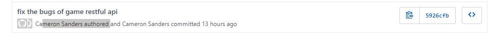

# NWEN304 Team project

Readme author: Zequn Jiang

Our project is host on heroku, click [here](https://nwen304-team-project.herokuapp.com/) to browse our website

## How to use our code

```Text
1. Download the project
2. Run 'npm install'
3. Create .env file in the root folder, add environment variables to .env file.
    Variable for postgreSQL: DATABASE_URL
    Variable for passport-facebook:
            FB_APP_ID
            FB_APP_SECRET
            FB_CALLBACK_URL
    Variable for passport-google-oauth 2:
            GOOGLE_CLIENT_ID
            GOOGLE_CLIENT_SECRET
            GOOGLE_CALLBACK_URLS
4. Run 'npm start' to start the app
```

## Related research

[Sample of using passport w/ mult strategies](https://gist.github.com/joshbirk/1732068)

## cURL

[Find more here](assets/curl.md)</br>
[More curl here](assets/Curl(Antony).md)

## Small things to be aware of

1. I was working on other people's laptop and forget to config the git user.name and git user.email


